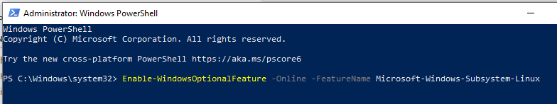
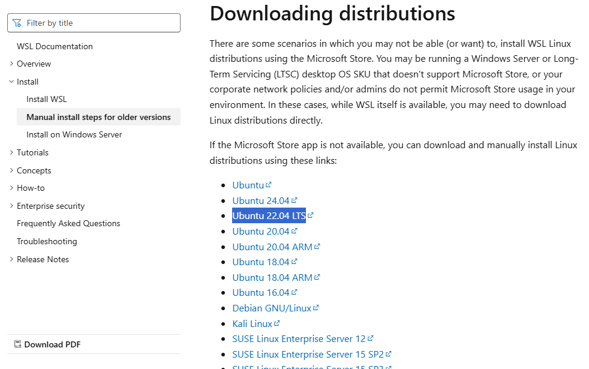
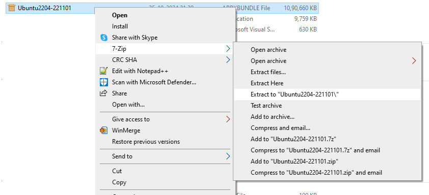
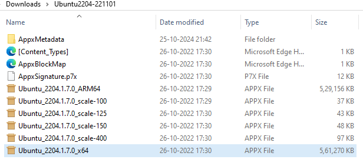
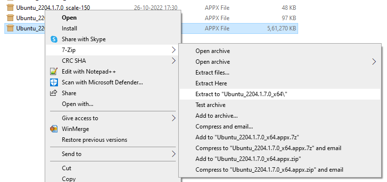
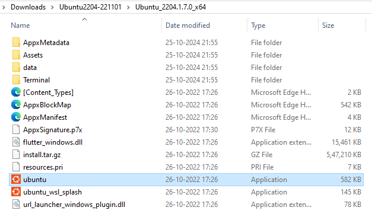

# Linux_System_Programming
* program for Linux System Programming.


# WSL-UUbuntu Installation
## (1) Enable Windows Subsytem for Linux

* To enable WSL in your machine, you would need PowerShell to be run as administration
* Run below command onw Windows Power Shell (**As administrator**)
```
Enable-WindowsOptionalFeature -Online -FeatureName Microsoft-Windows-Subsystem-Linux
```
<!----->


## (2) Download Ubuntu Distribution

Url to download: https://learn.microsoft.com/en-us/windows/wsl/install-manual#downloading-distributions

* There are various distribution -> download **Ubuntu 22.04 LTS** it will be around 1.0 GB with name: **Ubuntu2204-221101.AppxBundle**

<!--  -->


* Rename **Ubuntu2204-221101.AppxBundle** into **Ubuntu2204-221101.zip** and extract it using .zip


* Go inside to extracted folder and again extract **Ubuntu_2204.1.7.0_x64** which is with file extension APPX. see image below.

<!--  -->




* Go inside extracted folder **Ubuntu_2204.1.7.0_x64** and you will find Ubuntu application. Click or doble click.

<!--  -->
